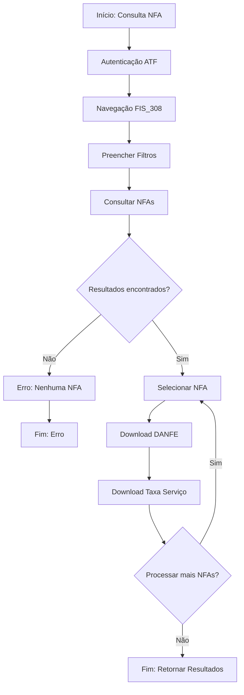

# 🔄 NFA Complete Pipeline - From Creation to Download

**Documentação completa do pipeline de automação NFA (Nota Fiscal Avulsa)**

---

## 📋 Visão Geral

Este documento mapeia o **pipeline completo** de processamento de NFAs, desde a **consulta no sistema ATF** até o **download dos arquivos DANFE e DAR (Taxa Serviço)**.

> **Nota Importante:** As NFAs não são **criadas** pelo sistema FoKS. Elas já existem no sistema SEFAZ-PB ATF. O pipeline **consulta, identifica, seleciona e baixa** os documentos PDFs.

---

## 🎯 Pipeline Stages

### **Stage 1: Autenticação no ATF**
**Arquivo:** `ops/scripts/nfa/nfa_atf.py` → `login()`

**O que acontece:**
1. Navega para `https://www4.sefaz.pb.gov.br/atf/`
2. Aguarda formulário de login (pode estar em iframe)
3. Preenche credenciais:
   - Username: `NFA_USERNAME` (env var ou Keychain)
   - Password: `NFA_PASSWORD` (env var ou Keychain)
4. Clica em "Avançar" (`btnAvancar`)
5. Verifica sucesso do login

**Selectors utilizados:**
- Username: `input[name="edtNoLogin"]` ou `input[id="login"]`
- Password: `input[name="edtDsSenha"]` ou `input[type="password"]`
- Submit: `button[name="btnAvancar"]`

**Logs:**
```json
{
  "action": "login",
  "status": "success",
  "timestamp": "2025-12-11T04:22:02Z"
}
```

---

### **Stage 2: Navegação para FIS_308**
**Arquivo:** `ops/scripts/nfa/nfa_atf.py` → `navigate_to_fis_308()`

**O que acontece:**
1. Navega diretamente para URL:
   ```
   https://www4.sefaz.pb.gov.br/atf/fis/FISf_ConsultarNotasFiscaisAvulsas.do?limparSessao=true
   ```
2. Aguarda carregamento completo da página
3. Identifica e entra no iframe `principal` (onde o formulário está)
4. Verifica se o formulário `frmConsultar` está presente

**Selectors utilizados:**
- Iframe principal: `iframe[name="principal"]`
- Formulário: `form[name="frmConsultar"]`

**Logs:**
```json
{
  "action": "navigate_to_fis_308",
  "iframe_detected": true,
  "form_found": true,
  "url": "https://www4.sefaz.pb.gov.br/atf/fis/FISf_ConsultarNotasFiscaisAvulsas.do"
}
```

---

### **Stage 3: Preenchimento de Filtros**
**Arquivo:** `ops/scripts/nfa/nfa_atf.py` → `fill_filters()`

**O que acontece:**
1. Preenche **Data Inicial**: `edtDtEmissaoNfaeInicial` (formato: `dd/mm/yyyy`)
2. Preenche **Data Final**: `edtDtEmissaoNfaeFinal` (formato: `dd/mm/yyyy`)
3. Preenche **Matrícula**: 
   - Tenta primeiro no iframe `cmpFuncEmitente`
   - Se não encontrar, tenta no contexto principal
   - Clica em "Pesquisar" após preencher matrícula (se necessário)
4. Clica em **"Consultar"** (`btnConsultar`)
5. Aguarda resultados carregarem

**Selectors utilizados:**
- Data Inicial: `input[name="edtDtEmissaoNfaeInicial"]`
- Data Final: `input[name="edtDtEmissaoNfaeFinal"]`
- Matrícula (iframe): `iframe[name="cmpFuncEmitente"]` → `input[type="text"]`
- Botão Consultar: `input[name="btnConsultar"]`

**Parâmetros de entrada:**
```python
{
  "from_date": "08/12/2025",
  "to_date": "10/12/2025",
  "matricula": "1595504"
}
```

**Logs:**
```json
{
  "action": "fill_filters",
  "from_date": "08/12/2025",
  "to_date": "10/12/2025",
  "matricula": "1595504",
  "consultar_clicked": true
}
```

---

### **Stage 4: Seleção da NFA**
**Arquivo:** `ops/scripts/nfa/nfa_atf.py` → `select_nfa_result()`

**O que acontece:**
1. Aguarda tabela de resultados carregar
2. Localiza radio buttons: `input[type="radio"][name="rdNFAE"]` ou `input[type="radio"][name="rdbNFAe"]`
3. Seleciona NFA:
   - **Por número específico:** Se `nfa_number` fornecido, busca na tabela
   - **Por índice:** Se não fornecido, seleciona pelo índice (0 = primeira)
4. Extrai número da NFA da linha da tabela (regex: `\d{9,}`)
5. Cria diretório de saída: `/Users/dnigga/Downloads/NFA_Outputs/NFA_{numero}/`

**Selectors utilizados:**
- Radio buttons: `input[type="radio"][name="rdNFAE"]`
- Linha da tabela: `table tbody tr:has(input[type="radio"][name="rdNFAE"])`

**Parâmetros de entrada:**
```python
{
  "nfa_number": "400123456",  # Opcional
  "index": 0  # Default: 0 (primeira NFA)
}
```

**Logs:**
```json
{
  "action": "select_nfa_result",
  "nfa_number": "400123456",
  "index": 0,
  "output_dir": "/Users/dnigga/Downloads/NFA_Outputs/NFA_400123456"
}
```

---

### **Stage 5: Download DANFE (Imprimir)**
**Arquivo:** `ops/scripts/nfa/nfa_atf.py` → `download_danfe()`

**O que acontece:**
1. Localiza botão **"Imprimir"**: `input[name="btnImprimirEletronica"]`
2. Configura download handler (Playwright `expect_download`)
3. Clica no botão "Imprimir"
4. Captura evento de download
5. Salva PDF em: `NFA_{numero}/NFA_{numero}_DANFE.pdf`
6. Valida que o arquivo é PDF válido (verifica header `%PDF`)
7. Retorna caminho completo do arquivo

**Selectors utilizados:**
- Botão Imprimir: `input[name="btnImprimirEletronica"]`

**Arquivo gerado:**
```
/Users/dnigga/Downloads/NFA_Outputs/NFA_400123456/NFA_400123456_DANFE.pdf
```

**Logs:**
```json
{
  "action": "download_danfe",
  "nfa_number": "400123456",
  "file_path": "/Users/dnigga/Downloads/NFA_Outputs/NFA_400123456/NFA_400123456_DANFE.pdf",
  "file_size_bytes": 245678,
  "status": "success"
}
```

---

### **Stage 6: Download DAR / Taxa Serviço**
**Arquivo:** `ops/scripts/nfa/nfa_atf.py` → `download_dar()`

**O que acontece:**
1. Localiza botão **"Emitir Taxa Serviço"**: `input[name="btnGerarTaxaServicoEletronica"]`
2. Configura download handler (Playwright `expect_download`)
3. Clica no botão "Emitir Taxa Serviço"
4. Captura evento de download
5. Salva PDF em: `NFA_{numero}/NFA_{numero}_TAXA_SERVICO.pdf`
6. Valida que o arquivo é PDF válido (verifica header `%PDF`)
7. Retorna caminho completo do arquivo

**Selectors utilizados:**
- Botão Taxa Serviço: `input[name="btnGerarTaxaServicoEletronica"]`

**Arquivo gerado:**
```
/Users/dnigga/Downloads/NFA_Outputs/NFA_400123456/NFA_400123456_TAXA_SERVICO.pdf
```

**Logs:**
```json
{
  "action": "download_dar",
  "nfa_number": "400123456",
  "file_path": "/Users/dnigga/Downloads/NFA_Outputs/NFA_400123456/NFA_400123456_TAXA_SERVICO.pdf",
  "file_size_bytes": 189234,
  "status": "success"
}
```

---

## 🔄 Fluxo Completo (Diagrama)



---

## 📦 Processamento em Lote (Batch)

### **Múltiplas NFAs em uma execução**

O script `nfa_atf.py` suporta processamento de **múltiplas NFAs** em uma única execução:

**Parâmetros:**
```python
{
  "from_date": "08/12/2025",
  "to_date": "10/12/2025",
  "matricula": "1595504",
  "max_nfas": 50,  # Processa até 50 NFAs
  "nfa_number": None  # Se fornecido, processa apenas essa NFA
}
```

**Comportamento:**
1. Após `fill_filters()`, o script identifica **todas as NFAs** disponíveis na tabela
2. Processa as primeiras `max_nfas` NFAs (ou todas, se menos que `max_nfas`)
3. Para cada NFA:
   - Seleciona radio button
   - Baixa DANFE
   - Baixa Taxa Serviço
   - Volta para lista de resultados
   - Próxima NFA

**Estrutura de saída:**
```
/Users/dnigga/Downloads/NFA_Outputs/
├── NFA_400123456/
│   ├── NFA_400123456_DANFE.pdf
│   └── NFA_400123456_TAXA_SERVICO.pdf
├── NFA_400123457/
│   ├── NFA_400123457_DANFE.pdf
│   └── NFA_400123457_TAXA_SERVICO.pdf
└── ...
```

**Resposta JSON (múltiplas NFAs):**
```json
{
  "status": "success",
  "nfa_number": "400123456",
  "danfe_path": "/Users/dnigga/Downloads/NFA_Outputs/NFA_400123456/NFA_400123456_DANFE.pdf",
  "dar_path": "/Users/dnigga/Downloads/NFA_Outputs/NFA_400123456/NFA_400123456_TAXA_SERVICO.pdf",
  "processed_count": 50,
  "all_results": [
    {
      "nfa_number": "400123456",
      "danfe_path": "...",
      "dar_path": "..."
    },
    {
      "nfa_number": "400123457",
      "danfe_path": "...",
      "dar_path": "..."
    }
    // ... até 50 NFAs
  ]
}
```

---

## 🔌 Integração via API

### **Endpoint FastAPI:**
```
POST /tasks/nfa_atf/run
```

**Request Body:**
```json
{
  "from_date": "08/12/2025",
  "to_date": "10/12/2025",
  "matricula": "1595504",
  "max_nfas": 50,
  "nfa_number": null,
  "headless": true,
  "output_dir": "/Users/dnigga/Downloads/NFA_Outputs"
}
```

**Response:**
```json
{
  "task": "nfa_atf",
  "success": true,
  "duration_ms": 125000,
  "payload": {
    "status": "success",
    "nfa_number": "400123456",
    "danfe_path": "/Users/dnigga/Downloads/NFA_Outputs/NFA_400123456/NFA_400123456_DANFE.pdf",
    "dar_path": "/Users/dnigga/Downloads/NFA_Outputs/NFA_400123456/NFA_400123456_TAXA_SERVICO.pdf",
    "processed_count": 50,
    "all_results": [...]
  }
}
```

---

## 📊 Preparação para Dados em Lote

### **Formato de entrada para lotes de 50+ NFAs**

Para processar **lotes grandes de NFAs**, você pode:

**Opção 1: Processar por data range (recomendado)**
```bash
# Processa todas as NFAs de um período
python3 ops/scripts/nfa/nfa_atf.py \
  --from-date "01/12/2025" \
  --to-date "31/12/2025" \
  --matricula "1595504" \
  --max-nfas 100
```

**Opção 2: Processar NFAs específicas (lista)**
```python
# Criar script que itera sobre lista de números NFA
nfa_list = [
  "400123456",
  "400123457",
  # ... até 50 ou mais
]

for nfa_number in nfa_list:
    result = await automation.run(
        nfa_number=nfa_number,
        max_nfas=1
    )
```

**Opção 3: Via API com lista de NFAs**
```json
POST /tasks/nfa_atf/run
{
  "from_date": "01/12/2025",
  "to_date": "31/12/2025",
  "matricula": "1595504",
  "max_nfas": 100  # Processa até 100 NFAs encontradas
}
```

---

## 🗂️ Estrutura de Arquivos Gerados

### **Por NFA:**
```
/Users/dnigga/Downloads/NFA_Outputs/
└── NFA_{numero}/
    ├── NFA_{numero}_DANFE.pdf          # Documento Auxiliar da Nota Fiscal Eletrônica
    └── NFA_{numero}_TAXA_SERVICO.pdf   # Documento de Arrecadação de Receitas / Taxa de Serviço
```

### **Exemplo real:**
```
/Users/dnigga/Downloads/NFA_Outputs/
├── NFA_400123456/
│   ├── NFA_400123456_DANFE.pdf
│   └── NFA_400123456_TAXA_SERVICO.pdf
├── NFA_400123457/
│   ├── NFA_400123457_DANFE.pdf
│   └── NFA_400123457_TAXA_SERVICO.pdf
└── ...
```

---

## ⚙️ Configuração

### **Variáveis de Ambiente:**
```bash
export NFA_USERNAME="seu_usuario"
export NFA_PASSWORD="sua_senha"
```

### **Ou via macOS Keychain:**
```bash
security add-generic-password \
  -a "seu_usuario" \
  -s "FoKS_NFA_ATF" \
  -w "sua_senha"
```

### **Arquivo de Configuração:**
`ops/scripts/nfa/config.json`:
```json
{
  "default_matricula": "1595504",
  "default_output_dir": "/Users/dnigga/Downloads/NFA_Outputs",
  "atf_base_url": "https://www4.sefaz.pb.gov.br/atf/",
  "timeout_seconds": 600,
  "wait_timeout_ms": 30000
}
```

---

## 🐛 Tratamento de Erros

### **Erros Comuns:**

1. **Login falhou:**
   - Verificar credenciais
   - Verificar se ATF está acessível
   - Verificar se não há captcha/2FA

2. **NFA não encontrada:**
   - Verificar filtros de data
   - Verificar matrícula
   - Verificar se NFA existe no período

3. **Download falhou:**
   - Verificar espaço em disco
   - Verificar permissões de escrita
   - Verificar se botão está visível

4. **Timeout:**
   - Aumentar `timeout_seconds` no config
   - Verificar conexão de internet
   - Verificar se ATF está lento

---

## 📝 Logs e Monitoramento

### **Logs estruturados:**
Todos os logs são estruturados em JSON e enviados para `stderr`:

```json
{
  "timestamp": "2025-12-11T04:22:02.123Z",
  "level": "INFO",
  "logger": "nfa_atf",
  "message": "DANFE downloaded",
  "payload": {
    "nfa_number": "400123456",
    "file_path": "/Users/dnigga/Downloads/NFA_Outputs/NFA_400123456/NFA_400123456_DANFE.pdf",
    "file_size_bytes": 245678
  }
}
```

### **Arquivo de log JSONL:**
`/Users/dnigga/Downloads/NFA_Outputs/nfa_runs.jsonl`:
```jsonl
{"status":"success","nfa_number":"400123456","danfe_path":"...","dar_path":"...","started_at":"2025-12-11T04:22:02Z","finished_at":"2025-12-11T04:23:15Z"}
{"status":"success","nfa_number":"400123457","danfe_path":"...","dar_path":"...","started_at":"2025-12-11T04:23:16Z","finished_at":"2025-12-11T04:24:28Z"}
```

---

## 🚀 Próximos Passos

Para processar **lotes de 50+ NFAs**, você pode:

1. **Compartilhar lista de números NFA** → Criaremos script de batch
2. **Compartilhar range de datas** → Processaremos todas as NFAs do período
3. **Compartilhar dados estruturados** → Criaremos parser e processador customizado

**Aguardando seus dados para implementar o processador de lotes! 📦**

---

**Última atualização:** 2025-12-11  
**Versão do pipeline:** 1.0.0  
**Status:** ✅ Pronto para processamento em lote
